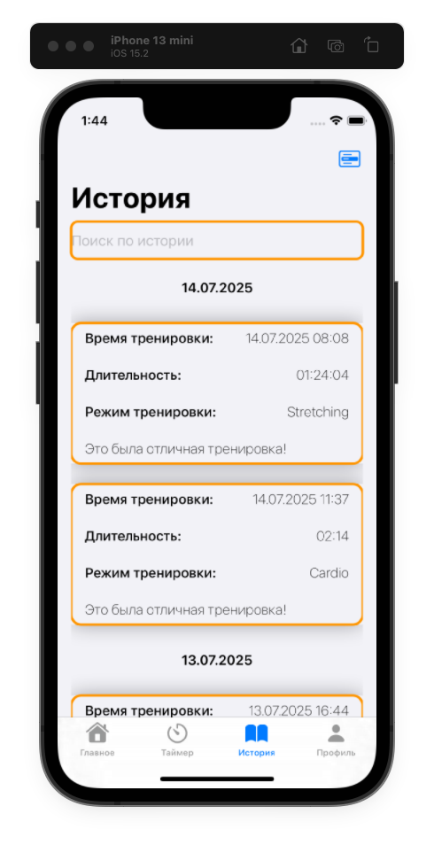

# SportTimer
Тестовое задание для iOS

SportTimer - простое iOS-приложение представляющее собой трекер тренировок с таймером для отслеживания и сохранения спортивных активностей

# Архитектура проекта

1. UI - в проекте используется SwiftUI
2. Персистентность данных - используется CoreData со следующими моделями
- Workout - хранение данных тренировок с полями: id - айдишник тренировки используется для удаления записей, type - тип тренировки, duration - длительность тренировки в секундах, date - дата тренировки, notes - заметки о тренировки
- LastTraining - используется для определения статуса тренировки (не начата, в процессе, на паузе) и позволяет восстанавливать таймер даже в случае принудительной выгрузки приложения пользователем из списка запущенных прил. Содержит поля: timerStartedAt - unixtime для времени когда тренировка была начата или возобновлена с паузы, timerPausedAt - время когда тренировку поставили на паузу, numberOfSecondsCounted - кол-во секунд уже отсчитанное таймером между началом и паузой тренировки, type - тип тренировки
- AppSettings - хранение настроек приложения. Содержит в себе поле timerSoundID для хранения предпочтительного звука для таймера
3. Для загрузки аватара используется системный фреймворк Photos и PHAsset, с корректно добавленной строчкой в Info.plist с разрешениями доступа к галерее
4. Для действий требующих подтверждения пользователя (при удалении истории или завершении тренировки) используются системные alert-ы в соответствии с Human interface guidelines
5. По максимуму используются системные изображения и шрифты чтобы избежать разрастания Assets
6. Используются custom views для индикатора секунд, кнопок и swipeable-карточки для тренировок
7. Корректно используется навигация и работают анимированные переходы между экранами
8. Не используются никакие сторонние либы в проекте
9. Архитектура - MVVM с использованием ObservableObject в качестве слоя для вьюмодели
10. Для длительных операций в фоне (например чтение из CoreData или сохранение аватара) используются async-функции, с корректным использованием @MainActor для обновления стейта когда это необходимо
11. Используются Background modes для поддержки приложения в фоне (background processing и remote notifications)

#### Скриншоты

